# Preparación evaluación S.O N°3

Docente : Jorge Ramirez 

Integrantes:

- Diego Farias
- Vicente Berríos

SISTEMAS OPERATIVOS CORPORATIVOS_001D

# LINUX

•  **Cree un servidor virtual Linux con 2 Vcpu y 4 GB de RAM.** 

Buscamos el tipo de instancia amazon linux y elegimos  “T3.Medium” que es la que cumple con 2Vcpu y 4GB de ram

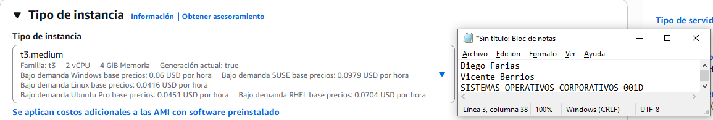

- **Configure los security group respectivos, de forma que les permita acceso a los servicios SSH y HTTP, en los comentarios de conexión utilice su nombre y apellido.**

Habilitamos protocolos ssh y http para permitir la conexión remota y dejamos como descripción mi nombre y apellido

- **IP publica de la instancia**

Identificamos la ip pública: 3.94.196.141

- **Nombre de DNS de la instancia**

Identificamos el dns bajo el nombre de http://ec2-3-94-196-141.compute-1.amazonaws.com/

- **Cree la llave de conexión con su apellido.**

Creamos la clave para luego acceder por ssh

**Conéctese al server a través del cliente ssh (Putty u otro).**

Nos conectamos con ssh a linux desde el sistema windows usando powershell

- **Instale el servicio httpd**

Instalamos el servicio httpd (apache) con los siguientes comandos:

sudo dnf install httpd -y 

- **A través de comandos, verifique el estado en el que se encuentra HTTP en el servidor e inícielo.**

Verificamos e iniciamos el servicio con los comandos:

sudo systemctl start httpd // sudo systemctl status httpd

- **A través de comandos, modifique la página de bienvenida del sitio utilizando una página donde aparezca su nombre y el logo de Duoc UC, este archivo debe estar en el servidor, no un enlace a otro sitio con la imagen.**

Modificamos el sitio web html, agregamos nuestros nombres y copiamos la dirección de la imagen del logo de Duoc UC

- **Compruebe el funcionamiento del sitio WEB creado a través de su navegador.**

Luego en nuestro navegador buscamos el sitio web por la ip pública de la instancia o por el nombre que le asignó DNS

- **En el panel de administración de AWS Detenga la instancia Linux Creada.**

Y por último detenemos la instancia

Y por para finalizar, en esta última foto verificamos que la instancia creada aparece como “detenida”

# WINDOWS

1- Creacion de windows server 2019 con GUI

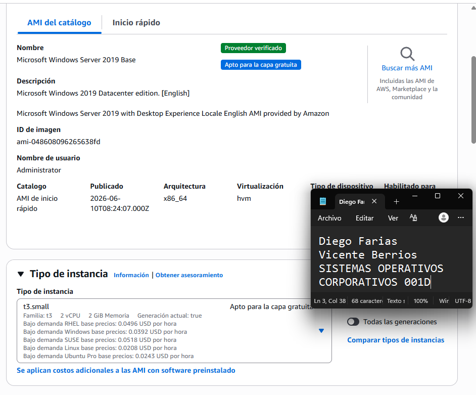

- En  la imagen se observa la eleccion de AMI , que en este caso es “Microsoft Windows Server 2019 Base” , ademas del tipo de instancia que es t3.small.

2- Creacion de los security  groups , permitiendo el acceso a los servicios de RDP , HTTP y FTP.

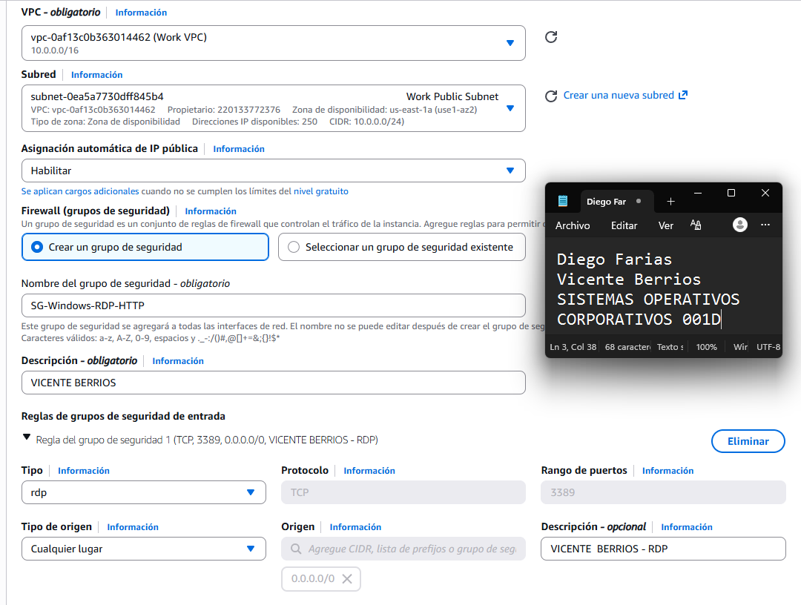

- Se observa la creación del grupo de seguridad llamado “SG-Windows-RDP-HTPP” , y con su respectiva descripción como se pide (nombre, apellido). Y en la imagen de abajo se observa los SG correspondientes a HTTP y FTP.

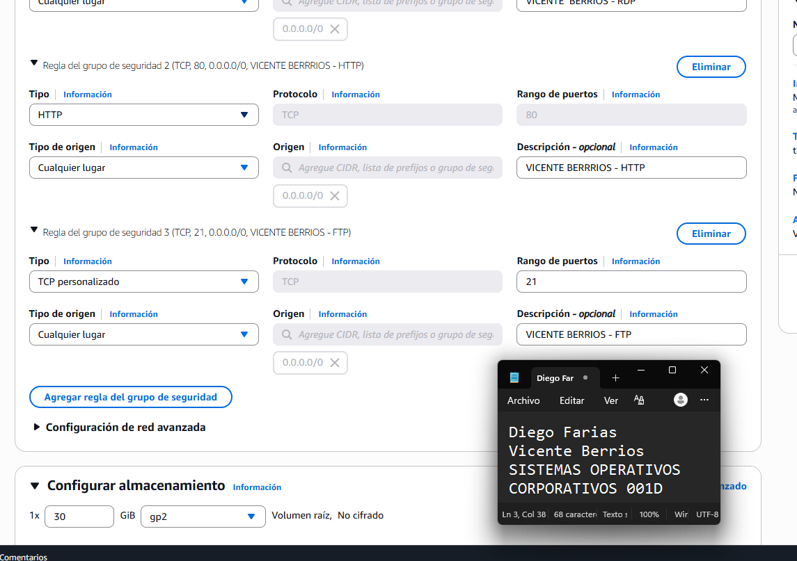

3- IP publica de la instancia y DNS

- A continuación en la imagen se observa lo que viene a ser la IP publica de la instancia ademas de tambien el DNS publico.
    
    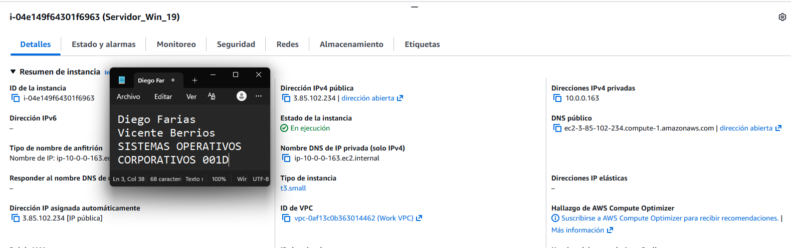
    

4-Creacion de la llave privada

- Se creo la llave privada guardándola como “Berrios.pem”
    
    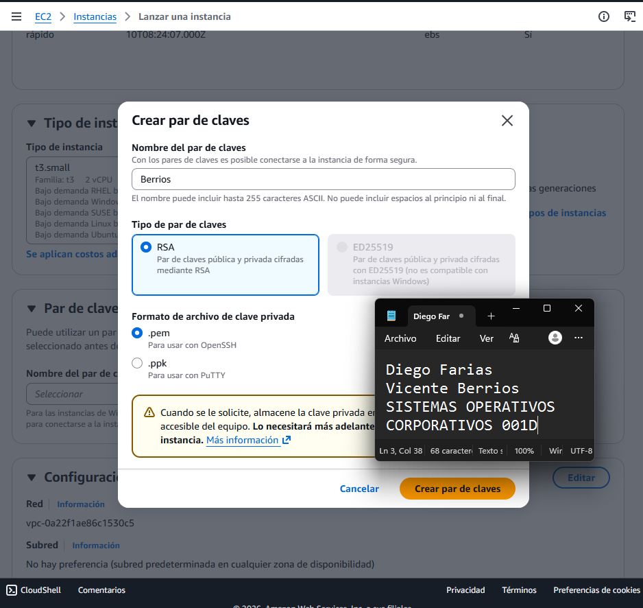
    
    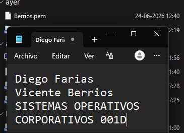
    

5- Conexión por RDP con la instancia de Windows server

- En las imágenes a continuación podremos ver como es la conexión mediante escritorio remoto hacia la instancia de win server , esto mediante el DNS publico, usuario Administrator y la contraseña que se obtuvo al descifrar el archivo Berrios.pem.

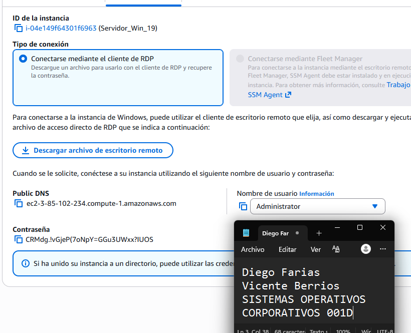

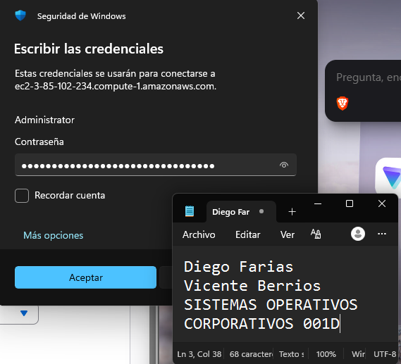

6- Instalacion de IIS y el rol de HTTP+FTP

- En la imagen se observa la instalacion de IIS.

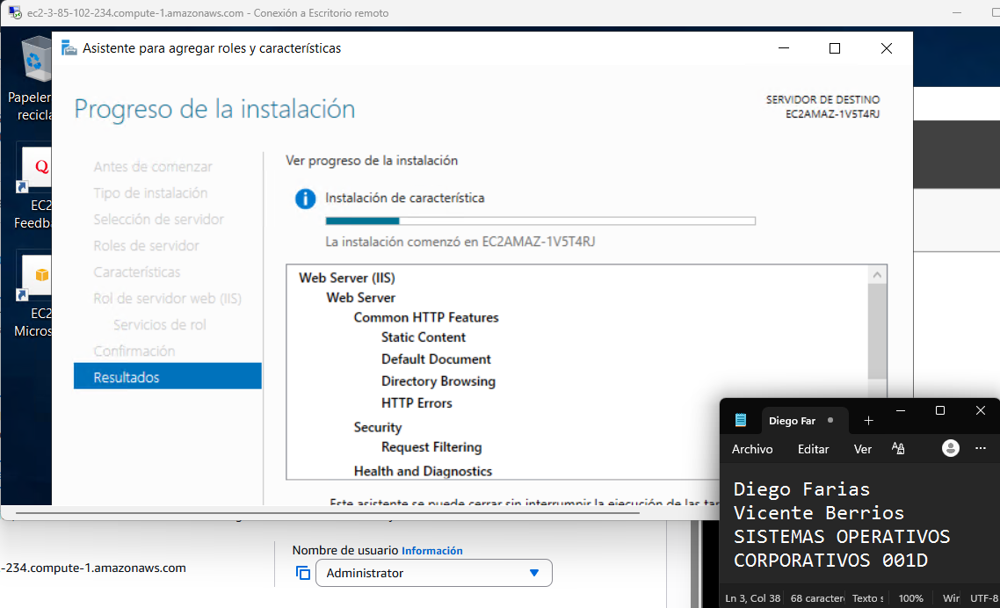

- Y en la imagen de abajo se ve la intalacion del rol de HTTP + FTP , y finalmente cuando se finaliza la correcta instalacion de los servicios.
    
    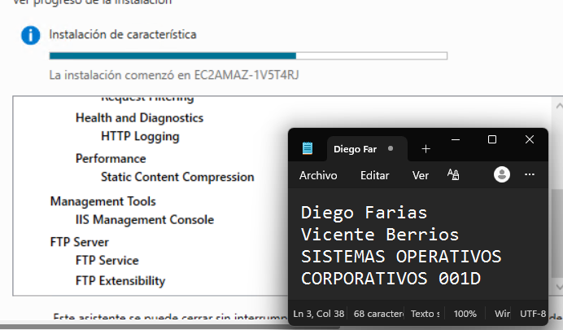
    
    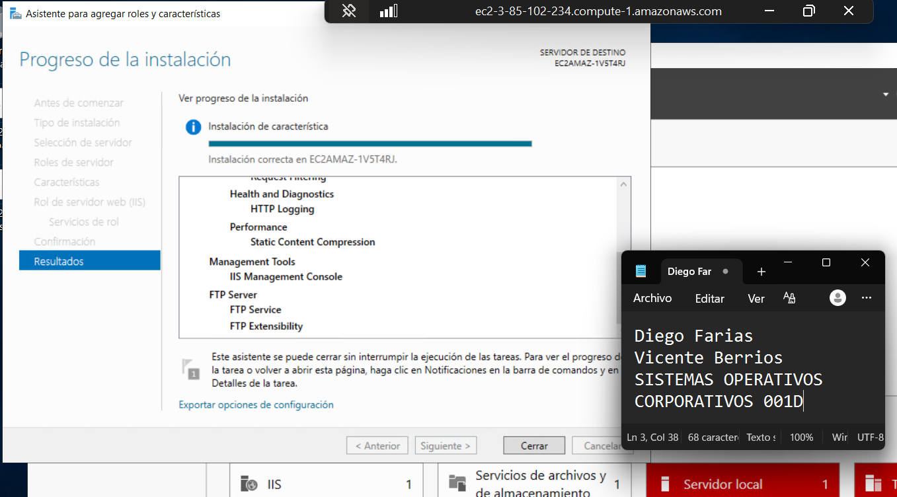
    

7- Verificacion de estado de los servicios

- A continuación revisamos con la herramienta de administración , el estado de los Servicios de HTTP y FTP.
    - HTTP
    
    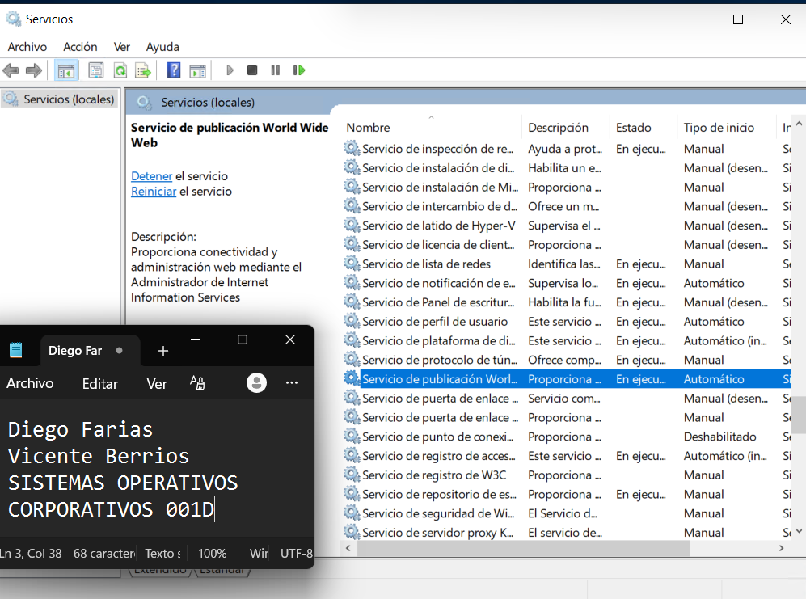
    
    - FTP
        
        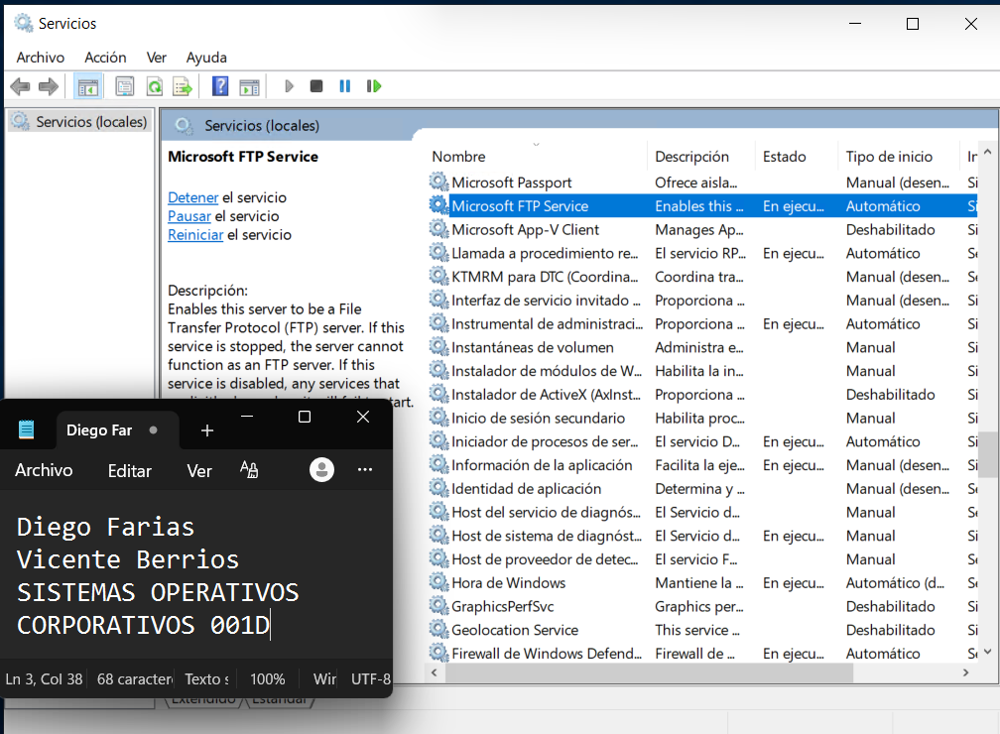
        

8- Modificación y Comprobacion de la pagina de bienvenida del sitio web.

- Se modifico el archivo index.html  , para que la pagina de bienvenida muestre el nombre de un alumno y agregándole el logo de DuocUC. La conexion se realizo a través de la IP publica de la instancia de Windows Server.
    
    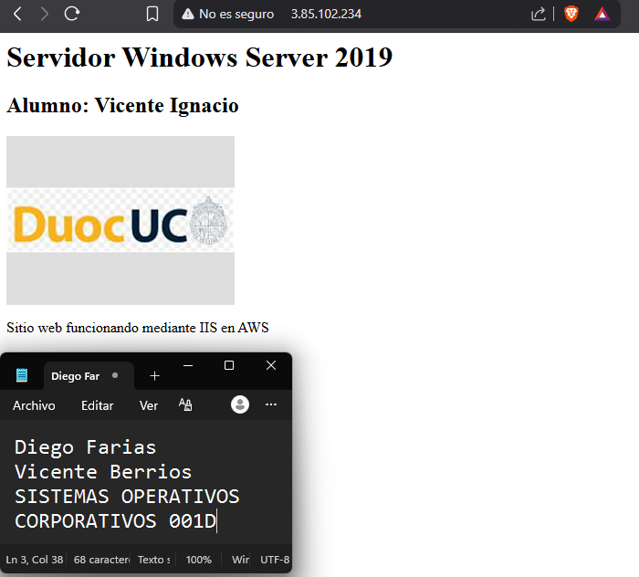
    

9- Funcionamiento de FTP

- Se intento verificar por navegador , pero no se logro ya que al momento de poner la dirección IP o de nombre de DNS en el navegador me redirigía hacia el navegador Explorer , y al intentar la conexión arrojaba error como se puede ver en la imagen a continuacion.
    
    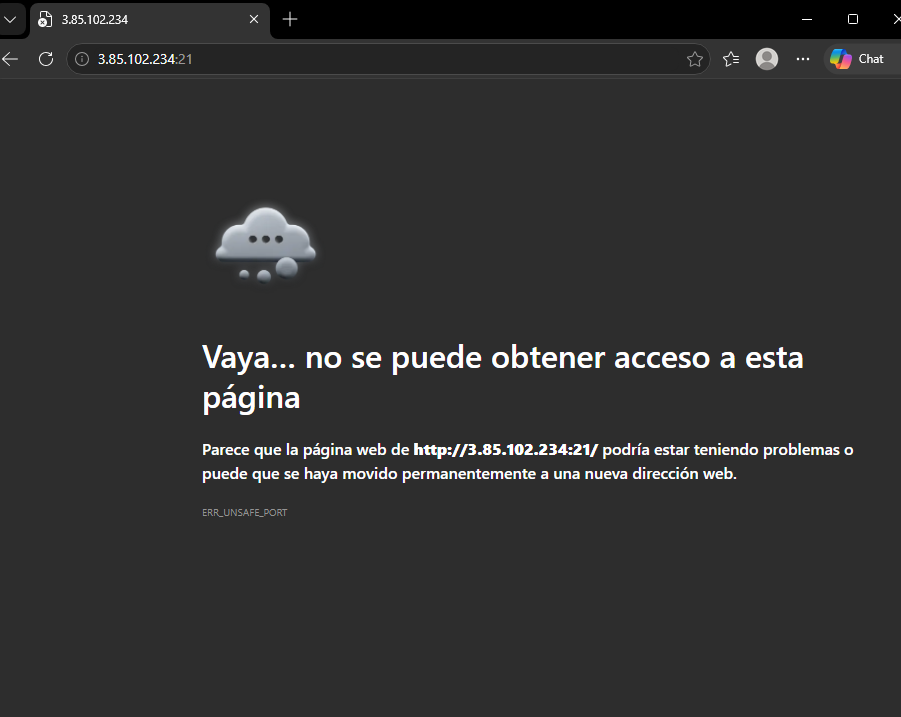
    
- Pero si se pudo comprobar el funcionamiento mediante la terminal de comandos y se pudo visualizar el archivo “prueba.txt” creado en la carpeta que aloja al servicio FTP.
    
    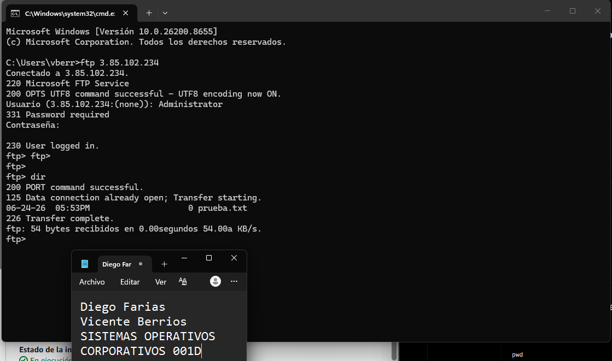
    

10- Finalmente en el panel de administracion de las instancias , se detuvo la instancia de Windows Server.

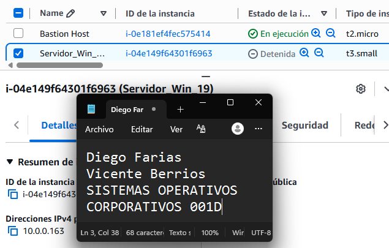